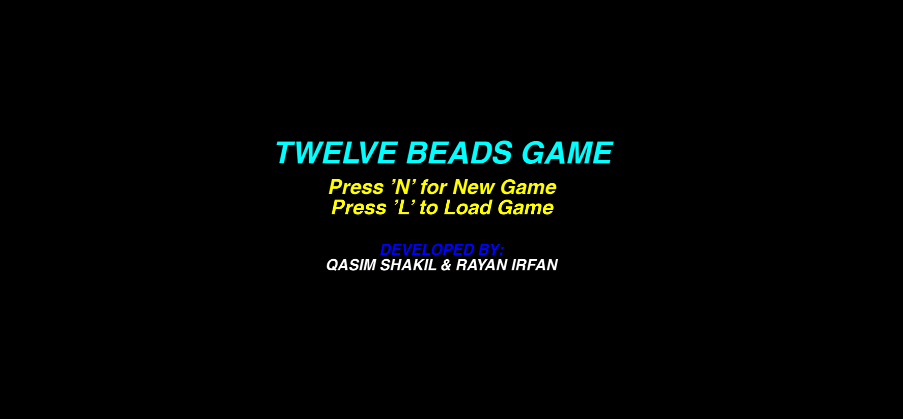
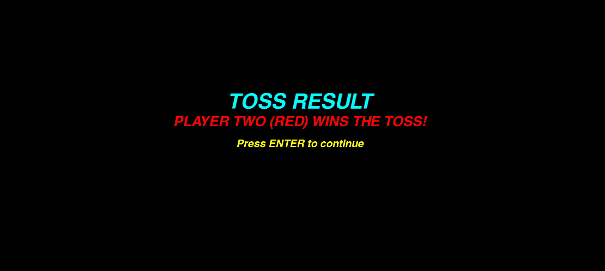
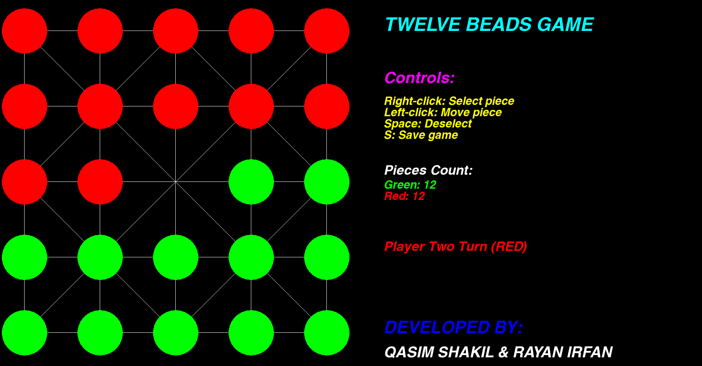
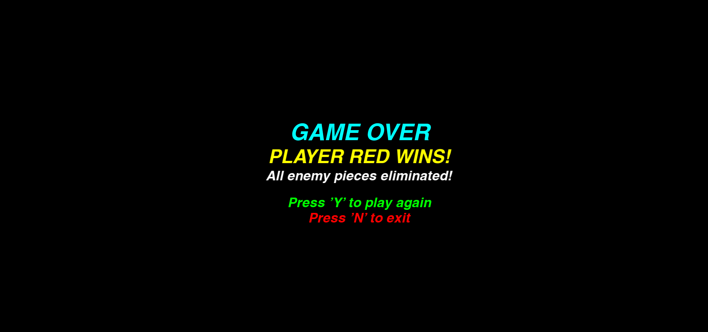

# 🎮 Twelve Beads Game

**Twelve Beads** is a modern C++ recreation of the classic South Asian board game *Bara Tehni Wala Khel*, built using **SFML** (Simple and Fast Multimedia Library). It’s a two-player strategic game where each side aims to eliminate the opponent's beads by making legal single or jump moves across a star-patterned grid.

---

## 🧩 Game Overview

- **Players:** 2
- **Beads per player:** 12
- **Grid Size:** 5x5
- **Victory Condition:** Eliminate all opponent beads.
- **Game Elements:**
  - 🎲 Toss System for deciding the first move
  - 💾 Save & Load Game functionality
  - 🔁 Play Again / Exit option after game ends
  - 🖱️ Mouse-driven controls with clear visual feedback

---

## 🖼️ Game UI

The board features a custom star-patterned connection grid where each intersection may have a bead. The connections follow traditional patterns with legal single and jump moves. The UI dynamically shows:

- Current turn (Green or Red)
- Remaining beads for each player
- Helpful instructions and controls

---

## 🎮 Controls

| Action            | Key / Mouse         |
|-------------------|---------------------|
| New Game          | `N` (on main menu)  |
| Load Game         | `L` (on main menu)  |
| Select Piece      | `Right Click`       |
| Move Piece        | `Left Click`        |
| Deselect Piece    | `Spacebar`          |
| Save Game         | `S`                 |
| Confirm / Continue| `Enter`             |
| Restart Game      | `Y` (on win screen) |
| Exit              | `N` (on win screen) |

---
## Start Screen

---
## Toss Screen

## Gameplay
---

## Winner Screen
---



## ⚙️ How to Run

### 🧱 Prerequisites
- C++ compiler (g++ / MSVC)
- [SFML Library](https://www.sfml-dev.org/download.php)
- `SwanseaBoldItalic-p3Dv.ttf` font file in the working directory

### 🛠️ Compilation (Example using g++)

```bash
g++ -std=c++17 -o 12Beads main.cpp -lsfml-graphics -lsfml-window -lsfml-system
